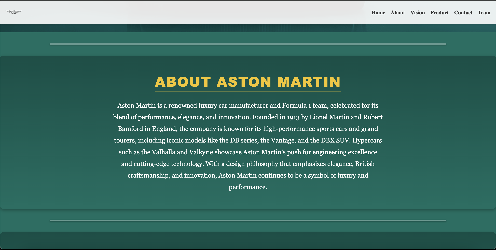
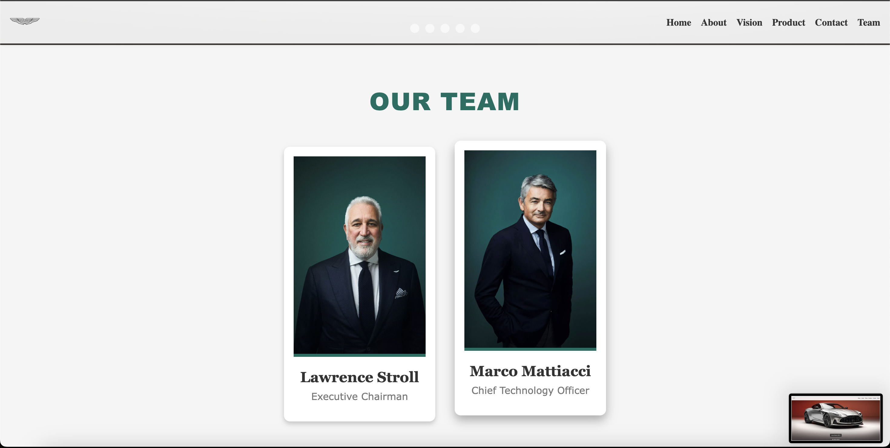
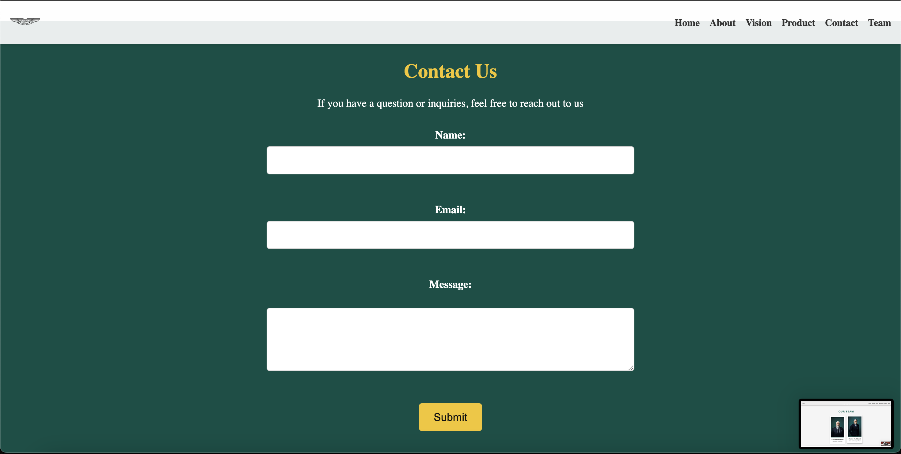
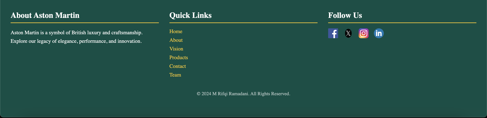

# Aston Martin Responsive Website

This project is a responsive website showcasing the elegance, legacy, and vision of Aston Martin. It is built using **HTML**, **CSS**, and **JavaScript** to provide a dynamic and visually appealing user experience.

---

## 🚀 Features

- **Splash Screen**: Animated splash screen with fade-in effects.
- **Responsive Design**: Fully optimized for desktop, tablet, and mobile devices.
- **Hamburger Menu**: Interactive navigation for smaller screens.
- **CSS Animations**: Smooth transitions and hover effects.
- **Product Slider**: Interactive slider showcasing Aston Martin models.
- **Contact Form**: A fully functional and styled contact form.

---

## 📂 Project Structure

```plaintext
├── index.html         # Splash Screen Page
├── home.html          # Main Homepage
├── css/style.css      # Stylesheet for all pages
├── script.js          # JavaScript for animations and interactivity
├── img/               # Images used across the site
└── README.md          # Project Documentation
```

---

## 🛠️ Setup Instructions

Follow these steps to run the project locally:

1. Clone the repository:

   ```bash
   git clone https://github.com/rifqi-16/milestone-1-rifqi-16.git
   ```

2. Navigate to the project directory:

   ```bash
   cd milestone-1-rifqi-16.git
   ```

3. Open `index.html` in your web browser to launch the splash screen.

---

## 🖼️ Screenshots

### 1. Splash Screen


### 2. Home.html










---

## 📦 Dependencies

### Fonts

- [JetBrains Mono](https://fonts.google.com/specimen/JetBrains+Mono)
- [Libre Baskerville](https://fonts.google.com/specimen/Libre+Baskerville)
- [Poppins](https://fonts.google.com/specimen/Poppins)

### External Libraries

- **None**: The project is built using vanilla HTML, CSS, and JavaScript.

---

## ✨ Design Considerations

1. **Minimalist Layout**:

   - The design emphasizes simplicity and elegance to reflect Aston Martin’s luxury.
   - A color palette of green, white, and gold is inspired by Aston Martin's branding.

2. **Responsiveness**:

   - CSS Media Queries ensure the site is fully optimized for all screen sizes.
   - The hamburger menu enhances usability for mobile devices.

3. **Animations**:
   - Smooth fade-in effects for the splash screen.
   - Transition effects for hover states to improve interactivity.

---

## 🔗 Links

- [Live Demo](#) _(Replace with link to hosted website)_
- [GitHub Repository](#) _(Replace with repository link)_
